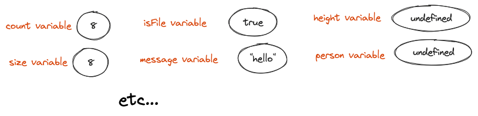
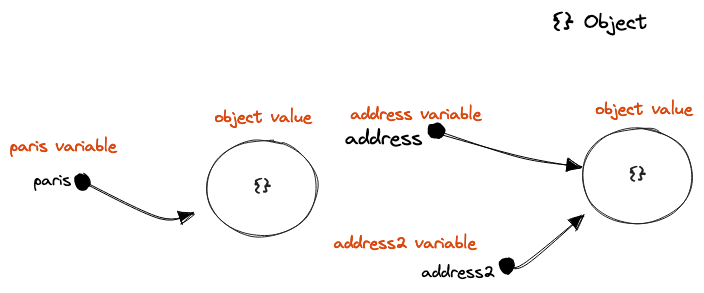

# Minimalist Javascript Reference

 * [Generic consideration](#generic-consideration)
 * [Comments](#comments)
 * [Variables](#variables)
 * [Constants](#constants)
 * [Control flow](#control-flow)
 * [Operators](#operators)
 * [Primitive value types](#primitive-value-types)
 * [Complex value type (object)](#complex-value-type)
    * [Object creation](#object-creation)
    * [Object properties](#object-properties)
    * [Object mutation](#object-mutation)
    * [Object equality](#object-equality)
    * [Functions](#functions)
    * [Object prototyping](#object-prototype)
    * [Object classes](#object-classes)
 * [Arrays fundamentals](#array-fundamentals)
 * [Rest parameters and property](#rest-parameter-and-property)
 * [Spread](#spread)
 * [Destructuring](#destructuring)
 * [Try catch](#try-catch)
 * [Modules](#modules)
 * [Async and promises](#async-and-promises)
 * [Closure](#closure)
 * [Hoisting](#hoisting)


## Generic Consideration

```js 
"use strict"                                    // use strict mode to catch errors early on
let a                                           // ; at end of statement is not mandatory 
let camelCase                                   // camelcase is the norm
```


## Comments 
Comment your code 

```js 
  */ Multi-line 
     comment */
  let city = "tokyo"                            // single line comment
```

## Variables 
Points to a primitive or object value

```js 
let c$nt = 0                                    // name can only contain letters, digits, or $ and _, not start with a digit
let cnt,CNT                                     // is case sensitive cnt != CNT 
let cnt                                         // declare
let cnt = 0                                     // declare and initialize 
let a = 1, b = 2                                // multi declare and initialize
let a = b = 1                                   // multi declare and initialize
```

## Constants 
Forbid variable to point to another value (throw TypeError at runtime)

```js 
const requestTime = 1.6                         // TypeError thrown if further assignement 
const COLOR = "BLUE"                            // use uppercase for pre-runtime constants
```

## Control flow 
Influence the order of execution of the statements.

```js
if () { }                                       // if 
if () { } else {}                               // if...else
if () { } else if () { }                        // if...else if

(a > 5) ? 100 : 0                               // if ternary: a >5 return 100 otherwise return 0

switch (a) {                                    // switch
  case 1:
    b = true
    break
  default:
    b = false
}

while () { }                                    // while
do { } while ()                                 // do...while

for (let i = 0; i < 10; i++) { }                // for

for (let i = 0; i < 10; i++) { break }          // with break: terminate the inner loop
l: for (let i = 0; i < 10; i++) { break l }     // with labeled break: terminate the labeled loop

for (let i = 0; i < 10; i++) { continue }       // with continue: skip current iteration of the most inner loop
l: for (let i = 0; i < 10; i++) { continue l }  // skip current iteration of the labeled loop
```

## Operators 
Perfom mathematical or logical function based on the values provided to the operator.

```js 
// arithmetic 
a + b                                           // addition
++a                                             // pre increment (value of expr returned after ++)
a++                                             // post increment (value of expr returned before ++)
a - b                                           // substraction
a--                                             // pre increment (value of expr returned after ++)/ 
--a                                             // post increment (value of expr returned before ++)
a * b                                           // multiplication
a / b                                           // division
a % b                                           // modulo 
a ** b                                          // exponential

// bitwise 
a & b                                           // bitwise and 
a | b                                           // bitwise or 
a ^ b                                           // bitwise xor 
~a                                              // bitwise not
a << 5                                          // shifts 5 bits to the left
a >> 5                                          // shifts 5 bits to the right
a >>> 5                                         // sifts 5 bits to the right and shifting zeros from left

// logic 
a && b                                          // logical and: true if a and b 
a || b                                          // logical or : true if a or b  
!a                                              // logical not: true if not a  

// nullish 
a ?? b                                          // return b if a is null or undefined 

//comparaison 
a == b                                          // avoid ! 
a != a                                          // avoid ! 
a === b                                         // true if a and b are pointing to the same value (memory address)
a !== b                                         // true if a and b are not pointing to the same value (memory address)
a > b                                           // true if a stricly greater than b
a >= b                                          // true if a greater or equal than b
a < b                                           // true if a strictly smaller than b
a <= b                                          // true if a smaller or equal than b

// ternary
(b >= 5) ? 100 : 0                              // if  b >=5 return 100 otherwise return 0

// assignement 
a = a                                           // assignment
a += 5                                          // a = a+5
a -= 5                                          // a = a-5
a *= 5                                          // a = a*5
a /= 5                                          // a = a/5
a %= 5                                          // a = a%5
a **= 5                                         // a = a**5
a <<= 5                                         // a = a<<5
a >>= 5                                         // a = a>>5
a >>>= 5                                        // a = a>>>5
a &= 5                                          // a = a&5
a &&= 5                                         // a = a&&5
a |= 5                                          // a = a|5
a ||= 5                                         // a = a||5
a ^= 5                                          // a = a^5
a ??= 5                                         // a = a ?? 5

//typeof
typeof(zipcode)                                 // give a a string representation of the type 
typeof(null)                                    // "object" although should be "null" (bug)

// coma 
a++, b--                                        // expr value is equal to last expr
```

## Primitive Value Types 

### There are 7 primitive value types. 

```js 
23                                              // number     
Infinity                                        // number : "a"/3
Nan                                             // number : 3/0                      
123n                                            // bigint     
"George"                                        // string     
true                                            // boolean    
false                                           // boolean    
null                                            // null       
undefined                                       // undefined  
Symbol("id")                                    // symbol
```

### There is only one immutable single value in memory for every possible primitive value ! 

```js 
let counter = 8                                 // var pointing to the 8 primitive value 
let size = 8                                    // same as above 
let message = "hello"                           // var pointing to the "hello" primitive value
let notification = "hello"                      // same as above 
let height, person                              // both points to undefined
```



## Complex Value Type 

### There is 1 complex value type: Object. 

Objects are collection of properties.

```js 
let motorcycle = {                              // creating an object
    brand: "Triumph",                           // property pointing to primitive value 
    "model": "daytona",                         // same as above, no difference by using "" 
    startEngine() {},                           // property pointing to function object value
    engine: {                                   // property pointing to object value 
        cylinder: 3 
    }
}
```

### Creation of objects always creates a brand new different value ! 

```js 
let paris = {}                                  // creating a new object 
let address = {}                                // also creating a new object
let address2 = address                          // address2 pointing to address object 
```



### Creating objects 
Different ways to create objects 

```js 
let car = {}                                    // using a literal
let car = Object.create(car)                    // using object.create

function Car(model) {}                          // using a constructor function with new 
let car = new Car("toyota")    
``` 


### Object properties
Object properties point to other values (primitive or object)

```js 
let motorcycle = {                              // create object using literal
  start: function() {},                         // old way of adding property pointing to a function object
  start() { },                                  // new way less verbose (ES6)
  brand: "Triumph",                             // creating property pointing to primitive value
  engine: {                                     // creating property pointing to object value 
    cylinder: 3,                                
    cc: 765
  }
}      

// access property
motorcycle.brand                                // access property using . notation 
motorcycle["brand"]                             // access property using [] notation
motorcycle.population                           // access unknown properties gives undefined
motorcycle.population.size                      // acess type error because accessing properties on undefined value

// add new property
motorcycle.model = "ST1200"                     // add new property
motorcycle.["model"] = "ST1200"                 // add new property using [] notation

// add new function property (methods)
motorcycle.repair = function() {}               // add a property pointing to a function object
``` 


### Object this 
The this variable reference the object that invokes the method

```js 
let soldier = {
  damage:3;
  attack() {
    return this.damage                          // this variable points to current soldier object
  }
}
``` 

Anonymous function have no 'this'
```js 
const person =  { 
  name: "Andrew",
  printNameWithArrow: () => console.log(this.name, this),
  printName() { console.log(this.name,this) }
}

person.printNameWithArrow()
person.printName()
```

### Object mutation
Objects are not nested (An object cannot be “inside” of another object), a property can only **reference** a value (primitive or object).
Another variable or property might be pointing to the inner object we change.

```js 
let house = {
  size: "32sqm",
  address: { street : "logan street" }          // pointing to independent new object
}

personAddress = house.address
personAddress.street = "fifth av"               // will change the house address
``` 


### Object equality 
Object equality operators

```js 
{} == {}                                        // don't use it 
{} === {}                                       // loose equality      : point at the same value (memory address) (exception NaN === NaN is false and -0 === 0 is true)
Object.is({}, {}).                              // same value equality : point at the same value (memory address) (no exceptions)
```

### Function Objects 
Function are special kind of objects: **objects** that you can call with ()

```js 
// named functions
function sayHi(){}                              // function definition
let fn = sayHi                                  // as function are object you can store,pass,return them
let ret = sayHi()                               // calling: always return a single value, undefined if no return

sayHi.description = "desc"                      // add a property variable to a function
sayHi.sayHello = function() { return "hi" }     // add another function to the function

// anonymous function
let fn = (function(){ return (a + b) })         // creation of anonymous function
let fn = () => a + b                            // shorthand creation version using => (no {} bracket and last statement value is returned)
```

### Understand Javascript Prototype (constructor, prototype, proto)
Used to create chain of objects

```js 

function Toy() { }                              // the Toy function object used to create Toy objects
let doll = new Toy()                            // a new Toy Object 
let nerfPistol = new Toy()                      // same 

// when creating a new object the function will use the same prototype for all the objects 
Toy.prototype                                   // prototype object which will be used as prototype for all new Toy objects
doll.__proto__                                  // link between a Toy object and his prototype
doll.__proto__.constructor                      // link to the function which create new Toy Object (aka the constructor)
doll.__proto__ === nerfPistol.__proto__         // true

// because Toy function is also an object 
Toy.__proto__                                   // prototype function for all the functions (an anonymous function)
Toy.__proto__.constructor                       // a function called Function which creates functions 
doll.__proto                                    // prototype of all Toy objects

// all objects have the root object as root
log(Toy.__proto__.
  __proto__ === doll.__proto__.__proto__)       // true

// another function 
function Game() { }                             // the Game function object

// a generic object 
let car = {}                                    // will call function Object()
car.__proto__                                   // prototype is the root object mother of all objects  

```


### Object classes  
Classes are only syntaxic sugar on top of prototype chains, no real new feature

```js 
class Toy {                                     // the Toy class used to create Toy objects
  constructor(name) {
    this.name = name
  }
  play() { }
}

let doll = new Toy()                            // a new Toy Object 
let nerfPistol = new Toy()                      // same 

class Game { }                                  // the Game class
```


## Arrays Object 
Arrays are special kind of objects: **Array objects** that are you used to store data

```js 
let numbers = [1, 2, 3, 4, 5, 6]                // create array using literal
let numbers = new Array(8)                      // create array with 8 empty elements
numbers.map(() => 4)                            // =nothing. By default iterator won't iterate over empty elements      

// mutate the original array
numbers.push(7)                                 // add a value at the end of the array
numbers.pop()                                   // pop (remove) a value at the end of the array
numbers.fill(0)                                 // fill in the array with default value (! value expression is eval once)
numbers.copyWithin(1, 4, 6)                     // copy values from index 4 -> 6 to index 1 
numbers.splice(1, 0, 22)                        // replace some parts of the array

// return a new array
numbers.concat([7, 8])                          // return new array: concatenate two arrays 
numbers.filter((number) => number % 2 === 0)    // return new array: filter only odd ones 
numbers.map((number) => number * 2)             // return new array: populated with the result of calling the function on every element
numbers.flatMap((number) => number * 2)         // return new array: same as map but followed by flat of one level
numbers.flat(1)                                 // return new array: flat the array of x depth 
numbers.slice(2, 4)                             // return new array: shallow copy of the array (from,to index)

//return undefined 
numbers.forEach((number) => log(number * 2))    // iterate on every value 

// return a value 
numbers.find((number) => number % 2 === 0)      // return single value: return the first element which satisfy the test
numbers.reduce((acc, curVal) => acc + curVal)   // return single value: reduce the whole array into one value
numbers.every((number) => number % 2 === 0)     // return boolean: does all the values of the array pass the test
numbers.some((number) => number % 2 === 0)      // return boolean: does at least one value pass the test

```

## Regex Object
Regex are objects.

```js
// creating regex object
let regex = /eng/g                             //using literal
let regex2 = new RegExp('/cyli*/g')            //using RegExp constructor

// methods on regex object 
/eng/g.exec('engine')                          // return array: containing info about matches
/eng/g.test('engine')                          // return boolean: true if string containts regex

// methods on the string object
"engine".match(/eng/g)                         // return array: with all the matches
"engine".matchAll(/eng/g)                      // return iterator: with all the matches 
"engine".search(/eng/g)                        // return number: index of the match
"engine".replace(/eng/g, 'rep')                // return string: new string with replacement
"engine".replaceAll(/eng/g, 'rep')             // return string: same as above but for all matches 
"engine".split(/eng/g)                         // return array: break the string into an array of substring
```

## Rest parameter and property
Collect multiple elements and condense it in one array of object. Must always be last.

```js
function sayHi(one, ...rest) { }               // condense all the rest arguments in one array
let [one,...rest] = [1,2,3]                    // condense all the rest of the array in one array
let { name, ...rest } = person                 // condense all the rest of the object into another object
```

## Spread 
Expand an iterable where multiple elements are expected 

```js
 sayHello(...["hello","andrew"])               // spread when calling a function
 let food = ['hamburger',...junkfood,'fries']  // merge two arrays
 let junkfood2= [...junkfood];                 // copy an array
 let complete = [...food, ...junkfood]         // concatenate arrays
```


## Destructuring 
Unpack values from array or objects to variables

```js
// with arrays
let junkfood = ['pizza', 'hamburger', 'pasta']  
let [piz, ham] = junkfood                       // destruct array values to variables
let [junk1, , junk3] = junkfood                 // skip values 
[piz, ham] = [ham, piz]                         // easily swap variables 

//with objects 
let { name: firstname, age: old } = person      // destruct property values to variables
let { name, age } = person                      // shortcut if variable has same name 
let { address: { street } } = person            // destruct nested property
let { lastname = "nicolas" } = person           // default value is used in case of "undefined", not used if "null"

//in function
function sayHello({ name, age }) { }            // while passing object to function 
function sayHello({ name = "nic"} = {}) { }     // with default value of {} for the object, you can call the function without any arguments

// in iterable
for (let { name, age } of persons) { }          // destruct person object to name, age variables

const junkfoods = [                              
  { id: 1, name: 'pizza' },
  { id: 2, name: 'hamburger' }
];
const [, { name }] = props;                     // combining arrays and object: name = "hamburger" 
```

## Optional chaining 
Access value of properties deep in a chain of objects without explicitly checking if each reference in the chain is null or undefined

```js
let person = {}                                 // create an empty object 

person.address.street                           // TypeError: trying to access property street on undefined primitive value 
person?.address?.street                         // no TypeError: person?.address immediatly return undefined because property address is undefined
```

## Try Catch
Catching error during runtime 

```js
const a = 3

try {
  a = 4                                         // typeError is raised 
  const b = 5                                   // not executed  
} catch (e) {                                   // catching 
  if (e instanceof RangeError) {
    console.log("handling")                     // handling if RangeError
  } else {
    throw e                                     // rethrowing the typeError 
  }
} finally {
  console.log("always")                         // always executed 
}
```

### Using async and await  
Used to write much more cleaner async handling 

```js
## Modules
Splitting javascript program into smaller chunks(modules) which can be imported when needed

```js

// Named Exports 
export function jump() {}                       // export a value during declaration
export { jump }                                 // export a value after declaration     
export { jump as jumpAround }                   // export and rename

// Default Export (only one per module)
export default function talk() {}               // export default value during declaration 
export default sayHello                         // export default value after declaration 

// Aggregating Exports                          // aggregate submodules in one 
export { Arms } from './arms.mjs'               // export one submodule value only
export * as Head from './head.mjs'              // export all submodule values under specific namespace 
```


```js
// Named imports
import { jump } from "./util.mjs"               // import value 
import { jump as jumpAround } from "./util.mjs" // import value and rename 

// Default Imports
import { default as hello } from './util.mjs'   // import default value 
import hello from './util.mjs'                  // same as above but shorter  

// Using namespace to avoid conflicting names   
import * as Util from './util.mjs'              // import all export from modules into namespace 
import { Arms,Head } from './util.mjs'          // import specific submodules 
```


## Async calls  
Asynchronous calls returns to the caller immediately before the completion of its processing

**A word of explanation about setTimeout before** 

```js
setTimeout(() => console.log("timeout"), 1000)  // return immediatly a Timeout object but execute after a delay the method passed as parameter
```

### Using Callbacks 
Using callbacks to handle asynchronous calls works but it makes the code difficult to follow

```js

let success = true

function lyricsApi(successClbk, errorClbk) {    // passing the function which will handle the response when the response arrive 
  setTimeout(() => {
    if (success) { successClbk("lyrics...") }   // use the success fn passed as parameters to handle the sucess
    else { errorClbk("error") }                 // use the error fn passed as parameters to handle the sucess
  }, 1000)
}

function handleError(error) {
  console.log(error)
}

function sing(song) {
  console.log(song)
}

songLyricsApi(sing, handleError)

```

### Using Promises
A Promise object represents the eventual completion of an asynchronous call. 
Promises were added to avoid callback tree problems (callback inside callback...)

```js

let success = true

function songLyricsApi() {
  return new Promise((resolve, reject) => {     // create a new promise object receiving success fn and error fn
    setTimeout(() => {
      if (success) { resolve("lyrics...") }     // calling the success fn
      else { reject("error") }                  // calling the error fn
    }, 1000)
  })
}

function handleError(error) {
  console.log(error)
}

function sing(song) {
  console.log(song)
}

function sayGoodbye() {
  console.log("bye")
}

songLyricsApi().then(sing, handleError)          // passing both success fn and error fn

songLyricsApi().then(sing)                       // promise chaining: then, catch always return a new generated promise
  .catch(handleError)
  .finally(sayGoodbye)                           // executed no matter what is the result (success, error) of the promise 
```

### Using async and await  
Used to write much more cleaner async handling 

```js
    
async function callApi() { }                         // async will wrap the return the value in a promise 
                                                     // which will be resolved when the function finish 

callApi().then(() => console.log("end"))             // execute when the function callApi is finished

// await: usage of wait only in async function
async function callOtherApi(ms) {
  await new Promise((resolve, reject) => {          // function execution wait here until the promise is fulfilled
    setTimeout(() => {
      resolve()
    }, ms);
  })                                                // again a promise object is returned which will be resolved when the method end
}
```

## Closure
A function which remember the context (variables, lexical environment) used when it was created

```js
function multiplier(factor) {
  return i => i * factor                            // function will remember the local variable "factor" despite scope of variable is over
}

let multiplyBy3 = multiplier(3)
let multiplyBy4 = multiplier(4)
```

## Hoisting
Hoisting is  moving all the declarations at the top of the scope before code execution 

```js
// compile time: var variables declaration (var counter) are hoisted and initialized to undefined 
console.log(counter)      // undefined 
var counter = 1

// compile time: let and const variables declaration (let name) are hoisted but not initialized
// runtime     : initialization happen
console.log(name)         // ReferenceError: cannot access 'name' before initialization  
let name = "laurent"

// compile time: function declaration are hoisted 
count()
function count() { }
```

